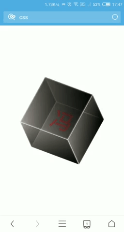
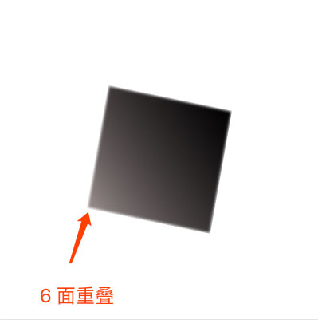
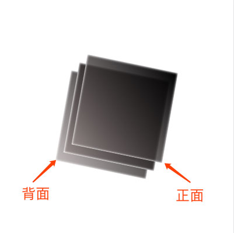
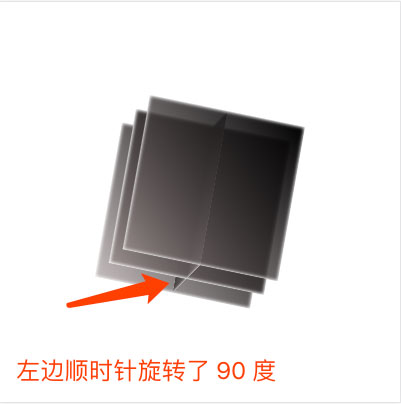
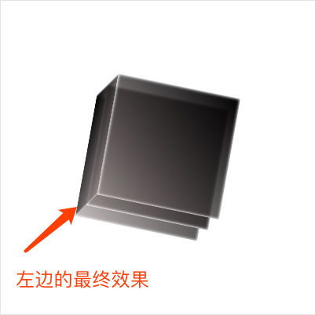
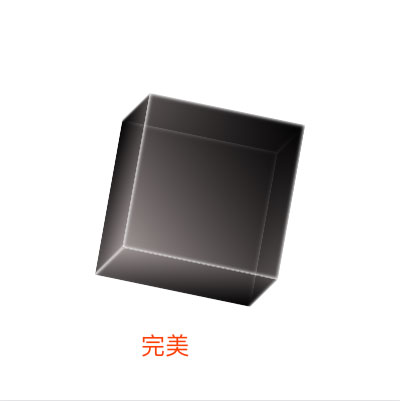
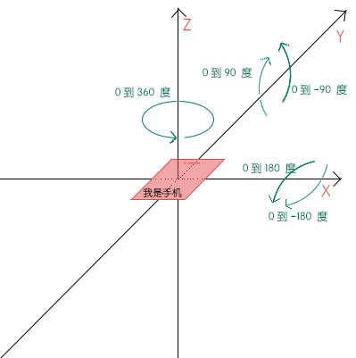

# 「移动设备陀螺仪」与「preserve-3d」碰撞的火花

> 涉及知识「CSS：transform、JS：deviceorientation」

废话不多，先上 [DEMO](http://hangyangws.win/demos/src/device_orientation/cube)「请使用移动设备查看」



### 如何搭建一个简单的立方体

只需要寥寥几行 HTML、CSS 代码就能产出一个「立方体」

- 核心 HTML 如下

```html
<div class="cube">
  <span class="cube-face cube-front"></span>
  <span class="cube-face cube-back"></span>
  <span class="cube-face cube-left"></span>
  <span class="cube-face cube-right"></span>
  <span class="cube-face cube-top"></span>
  <span class="cube-face cube-bottom"></span>
</div>

<!-- 6 个 <span /> 表示立方体的 6 个面 -->
<!--
 这里有个小插曲：
 起初，我使用的 6 个 <i /> 标签，因为大部分表示「图形、图标」的元素都用 <i /> 标签，
 不过，强迫症的我，细细想来，<i /> 是表示的「斜体文字」，语义上完全不匹配啊。
 所以，我在知乎上搜到这样一个描述：[为什么大家都用i标签<i></i>用作小图标?](https://www.zhihu.com/question/26880548)
 有个回答：
 「
   大家都遵循开放的标准来做事，未来可能少走弯路。
   少用 hack 的方法解决问题，有助于你写出向未来兼容的代码。
  」
  我很赞同，所以就把 <i /> 改成了 <span />。
 -->
```

- CSS 第一步

```css
.cube {
  width: 160px;
  height: 160px;
  position: relative;
  -webkit-transform-style: preserve-3d; /* 这一句重点 */
  transform-style: preserve-3d;
  -webkit-transform: rotateX(10deg) rotateY(10deg) rotateZ(10deg);
  transform: rotateX(10deg) rotateY(10deg) rotateZ(10deg);
}
.cube-face {
  display: block;
  position: absolute;
  width: 100%;
  height: 100%;
  box-shadow: inset 0 0 4px 1px #fff;
  box-sizing: border-box;
  background: -webkit-linear-gradient(45deg, rgba(156, 144, 144, .6), #000);
  background: -o-linear-gradient(45deg, rgba(156, 144, 144, .6), #000);
  background: linear-gradient(45deg, rgba(156, 144, 144, .6), #000)
}
```

这个 CSS 过于简单，就不赘述与解释。  
主要是要设置父元素 `.cube` 的 `transform-style: preserve-3d`，  
使子元素位于 3D 空间中，不然子元素都是「平面内、扁平化」，达不到 3D 效果。

给所有子元素 `.cube-face` 设置了透明的渐变色 `rgba(156, 144, 144, .6)` 背景，  
是为了更好的观察到「被遮住的反面」，视觉上更加 **立体**

目前效果截图大概是这个样子：



看起来就像一个正方形，其实是 6 个面全部重叠在一起。

- CSS 第二步

```css
.cube-front {
  -webkit-transform: translateZ(80px);
  transform: translateZ(80px);
}
```

上面 4 行代码使得「正面 `.cube-front`」向前移动 `80px`「也就是立方体一半的边长」。  
同理我们可以设置「背面 `.cube-back`」向后移动 `80px`  
效果大概是这样：



- CSS 第三步

```css
.cube-left {
  -webkit-transform: rotateY(90deg);
  transform: rotateY(90deg);
}
```

上面 4 行代码使得「左面 `.cube-left`」先顺时针旋转「90 度」  
大概是这个样子：



然后再向「左边」移动 `80px` 就 OK 啦，  
注意：左边是 Z 轴负方向。

```css
.cube-left {
  -webkit-transform: rotateY(90deg) translateZ(-80px);
  transform: rotateY(90deg) translateZ(-80px);
}
```

大概是这个样子：



同理，我们可以做出右边的效果，唯一区别就是，右边移动方向与左边相反。  
道理类似，异曲同工，上边和下边，想必聪明的大家都掌握了正确写法姿势。

成品大概是这个样子：



### 用陀螺仪使立方体动起来

细心的开发者应该发现了，在最开始，我给父元素 `.cube` 设置了：  
`transform: rotateX(10deg) rotateY(10deg) rotateZ(10deg)`  
让父元素在三维空间上旋转 10 度。  
如果我们动态连续修改这三个值，绝对可以达到 3D 旋转动画的效果。

这个时候，JS 的 [deviceorientation「检测设备方向」](https://developer.mozilla.org/zh-CN/docs/Web/API/Detecting_device_orientation#%E5%A4%84%E7%90%86%E6%96%B9%E5%90%91%EF%BC%88orientation%EF%BC%89%E4%BA%8B%E4%BB%B6) 事件闪现突然闪现在我的脑海。  
因为这个事件的回调参数里面恰好有三个参数「beta、gamma、alpha」，分别代表「X、Y、Z」的旋转方向。

**beta** 表示设备在 x 轴上的旋转角度，范围为 `[-180, 180]` 度。它描述的是设备由前向后旋转的情况。  
**gamma** 表示设备在 y 轴上的旋转角度，范围为 `[-90, 90]` 度。它描述的是设备由左向右旋转的情况。  
**alpha** 表示设备沿 z 轴上的旋转角度，范围为 `[0, 360]` 度。  

大概是这个样子：



- 注册 deviceorientation 事件，得到 x、y、z

```javascript
const handleOrientation = ({beta: x, gamma: y, alpha: z}) => {
  // 1. 得到 x、y、z
  // 2. 处理 x、y、z
  // 3. 使用 x、y、z
}

global.addEventListener('deviceorientation', handleOrientation)
```

- 处理 x、y、z

由于我们期望立方体可以在 x、y、z 三个反向的旋转范围是 `[-360, 360]` 度，  
但是 beta、gamma、alpha 的范围并不是我们期望的范围，所以我们要处理一下数据。  

```javascript
{
  x: x * 2,
  y: y * 4,
  z: (z - 180) * 2
}
```

- 使用 x、y、z

我们现在得到的 x、y、z 已经在 `[-360, 360]` 度范围内了，  
接下来要做的就是，使用 x、y、z 修改父元素 `.cube` 的 `rotateX(xdeg) rotateY(ydeg) rotateZ(zdeg)` 旋转值。

完整的代码大概是这样：

```javascript
const cube = document.querySelector('.cube')
const setCubePosition = ({x = 0, y = 0, z = 0}) => {
  cube.style = `transform: rotateX(${x}deg) rotateY(${y}deg) rotateZ(${x}deg);-webkit-transform: rotateX(${x}deg) rotateY(${y}deg) rotateZ(${x}deg);`
}
const handleOrientation = ({beta: x, gamma: y, alpha: z}) => {
  setCubePosition({
    x: x * 2,
    y: y * 4,
    z: (z - 180) * 2
  })
}

global.addEventListener('deviceorientation', handleOrientation)
```

### 庆祝时刻

现在我们已经完成了，一个利用「移动设备陀螺仪」与「preserve-3d」实现的 3D 交互效果。  
让我们为自己鼓掌  
 👏👏👏

[点我查看完整代码](https://github.com/hangyangws/demos/blob/master/src/device_orientation/cube.html)

---

感谢阅读
