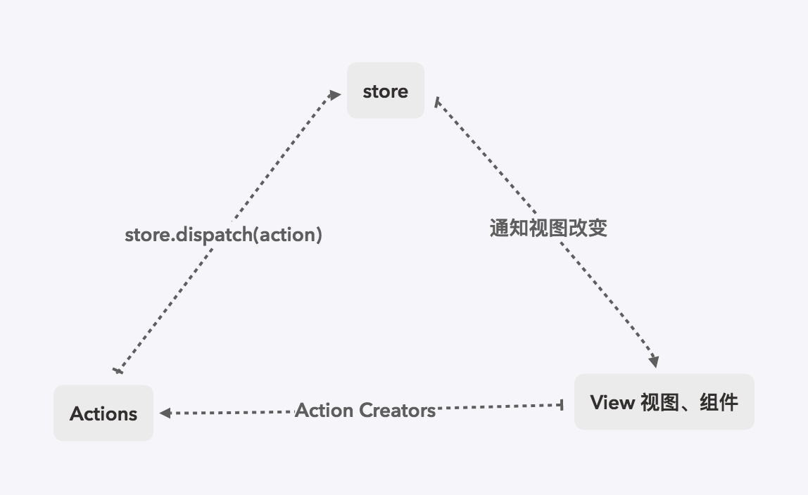
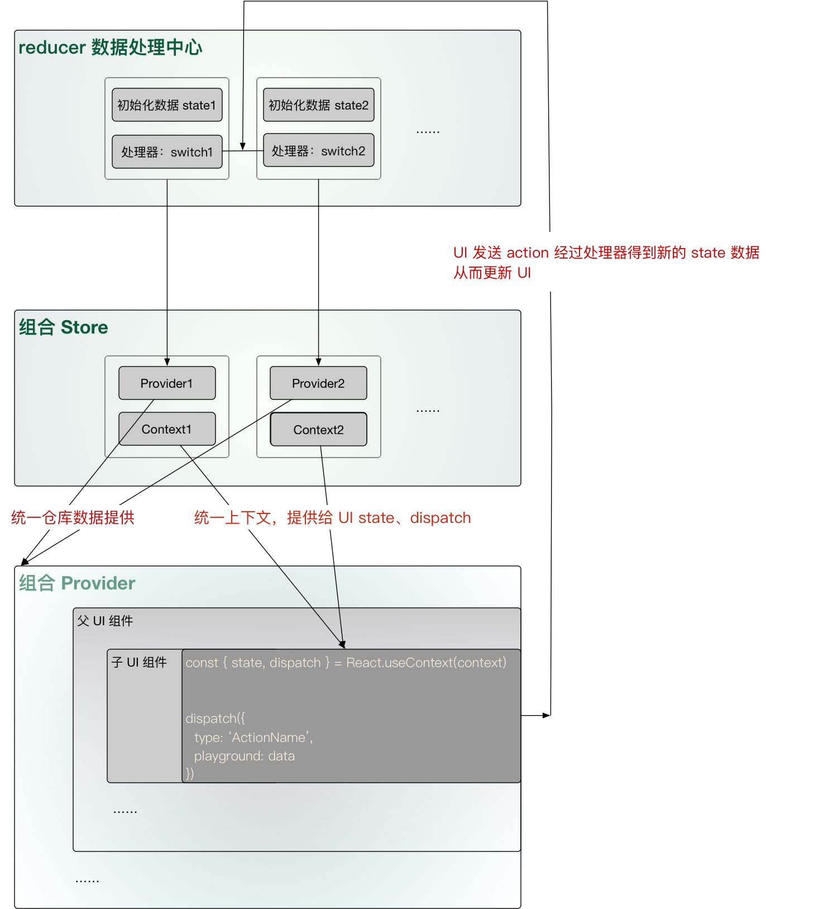
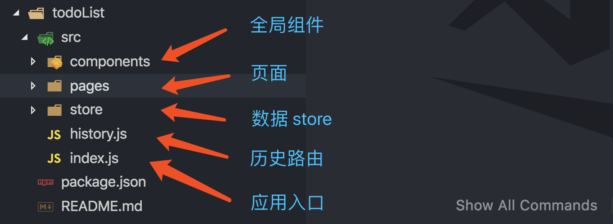
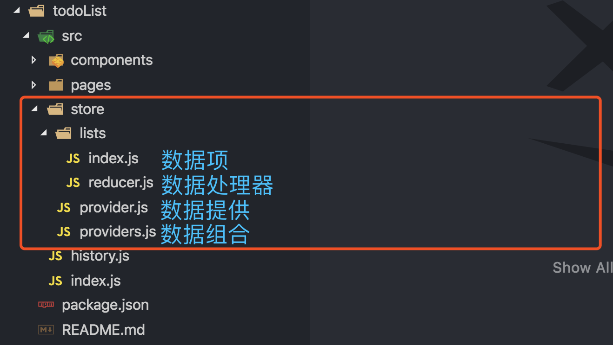

# 使用 React Hooks 代替 Redux

>*注：
此文章立场不表示 Hooks 可以完全代替 Redux。
因为 Redux 还有其他试用场景和功能，只在大部分场景可以用 Hooks 代替。
理性选择即合理。*

React Hooks 面世也有很大一段时间了。
我相信很多人对于 Hooks 的认知还大概处在：
1. 更 FP 编程方式
2. 更简洁易测的组件
3. 不用记住繁琐的生命周期函数
4. …

上述这些改变点其实已经足以说服很大一部分人升级他们的应用。
但是总是感觉少了点什么。

我们知道 React 是一个以构建 UI 为主的的库：
A JavaScript library for building user interfaces.
但是 UI 如果脱离了数据，基本上也就是耍流氓了。
所以有 Redux、Mbox… 这样的以数据管理为核心的就库出现了。
现实业务场景中，UI 与数据相辅相成。

在我最初学 React 的时候，原于成熟的方案、同事的推荐，直接是和 Redux 一起学习和上手开发的。
当时我就在想：React 为什么不能自己实现类似 Redux 那样的数据处理功能呢？ 
对于想学习 React 的同学，无疑是增加了学习 Redux 的成本，
更加深了 React 的门槛与神秘值「这可不是一个优秀的开源库该有的特质」。

往简单了说 Redux 就是实现了全局 state 、处理全局 state 的方式和统一的数据处理中心，也就是 store、dispatch 和 reducer。
虽然在 Hooks 之前我们可以通过 Context 模拟全局 state，但是我们还不能优雅的模拟 dispatch、reducer。

如果 React 能出一个数据处理的解决方案，
不单单是减少一个 Redux npm 包的 bundle 体积，
还降低了学习与构建 React 应用的成本，
最重要的是更统一化的数据处理思想。

年前，我在构建一个新的后台管理应用，考虑使用全新的 Hooks API。
当时 React 最新的版本还是 `16.7.0-alpha.2`。
在对于数据处理上，我尝试了新的 [React Context API](https://reactjs.org/docs/context.html#api)，
使用 Context `Provider` 和 `Consumer` 的方式实现去 Redux 的数据处理方案「这也是网上大部分推荐的去 Redux 方案」。
但是代码越写越多，数据越来越大，数据分类越来越多的时候，Context 显得力不从心，
虽然能解决需求，但是代码组织方式已经乱成了一锅粥「尝试过这个方案的人，应该知道我在说什么」。

> *注：更不要使用 useState + context 的方式创建全局仓库来代替 Redux。*

十分万幸的是，不久后 React 更新版本到 `16.8.1`。
推出了新的 Hooks：[useReducer](https://reactjs.org/docs/hooks-reference.html#usereducer)，惊喜之外意料之中。
这也就是这篇文章要讲的核心：使用 Hooks：useReducer 代替 Redux。

## 数据流对比

### redux



### hooks



### 简单分析

redux 的数据流程图画得比较简单，理解大概意思就好，毕竟它不是我要说的重点，
和 hooks 的数据流程相比其实是大同小异。

从 hooks 数据流能大致看出来，
我们设计好 store 后，通过对应的 hooks 函数生成每个 store 的 Provider 和 Context。
我们把所有的 Provider 糅合为一个整体的 Provider，作为所有 UI 的父组件。

在任何一个子 UI 组件内部，通过 hooks 函数得到对应 store 的 state、dispatch。
UI 组件内，通过主动调用 dispatch 发送 action，然后经过 store 的数据处理中心 reducer，就能触发相应的数据改变。
这个数据流程和 redux 几乎一模一样。

### 相同点

1. 统一 store 数据管理
2. 统一以 UI 发送 action 以修改数据
3. 都有 reducer action 处理中心

### 异同点

1. hooks UI 层获取 store 和 dispatch 不需要用 HOC 依赖注入，而是用 useContext
2. redux 在 action 之后改变视图本质上还是 state 注入的方式修改的组件内部 state，而 hooks 则是一对一的数据触发
3. hooks 的 reducer 来自于 useReducer

## 构建应用 DEMO

> 在构建应用之前，我们应该充分了解我们的应用，了解每一个 API 接口和返回的数据。这样不至于开发中期再来修改我们的仓库设计。
> 需要我们设计一个本地数「全局 store」，和相应的 action 用来修改这些数据。
> 其次就是目录设计了。
> 接下来我们以一个 TO DO Lists 为例开发一个纯 hooks 的 SPA 吧。

### 本地数据库设计

- 一个叫 list 的仓库
- 三个 action: 增「ADD」、删「DELETE」、改「MODIFY」

### 目录结构



这个目录是比较简单的，毕竟是个 DEMO，和 hooks 没关的没列出来。

#### index.js 应用入口

```javascript
...

import List from 'Pages/List/index';
import Layout from 'Components/Layout/index';

import history from './history';

ReactDOM.render(
  <Router history={history}>
    <Layout>
      <Switch>
        <Redirect exact from="/" to="/List" />
        <Route path="/list" component={List} />
        <Route component={NotFound} />
      </Switch>
    </Layout>
  </Router>,
  document.getElementById('container')
);
```

#### components/Layout/index 应用主结构

```javascript
...
// 引入组合 Provider
import Provider from 'Store/provider';

import Header from './components/Header/index';
import Footer from './components/Footer/index';

const Layout = (props) => (
  <Provider>
    <Header />
    {props.children}
    <Footer />
  </Provider>
);

export default Layout;
```

这里的代码很关键，在 Layout 中我们引入「组合 Provider」，
提供「统一仓库数据提供」的能力，让子 UI 组件能获取 store 数据。

### store 设计



#### provider.js

```javascript
...

import Lists from './lists/index';

const Provider = (props) => {
  return (
    <Lists.Provider>
      {props.children}
    </Lists.Provider>
  );
};

export default Provider;
```

仔细观察这里的代码人应该会发现一个问题：
在 store 拓展的的情况下，这个代码很可能出 **现代码嵌套地狱**，类似这样：

```javascript
...
// 多个 store 实例的情况
import One from './One/index';
import Two from './Two/index';
import Three from './Three/index';
...

const Provider = (props) => {
  return (
    <One.Provider>
      <Two.Provider>
        <Three.Provider>
          ...
          {props.children}
          ...
        </Three.Provider>
      </Two.Provider>
    </One.Provider>
  );
};

export default Provider;
```

所以需要 provider 组合器。

#### 优化后 provider.js

```javascript
...
import providers from './providers';

// 数据 Provider 组合器
const ProvidersComposer = (props) => (
  props.providers.reduceRight((children, Parent) => (
    <Parent>{children}</Parent>
  ), props.children)
);

const Provider = (props) => {
  return (
    <ProvidersComposer providers={providers}>
      {props.children}
    </ProvidersComposer>
  );
};

export default Provider;

```

上面代码灵感来自：[How to combo multiple ContextProvider](https://github.com/facebook/react/issues/14520)

#### providers.js

```javascript
import Lists from './lists/index';

const providers = [Lists.Provider];

export default providers;
```

即使有多个 Provider 我们也可以通过一维数组搞定啦！

### 数据项 && 数据处理器

在构建好基本的 Provider 后，我们需要提供基本的数据项和 reducer。

#### 数据项

```javascript
import React, { useReducer } from 'react';

import reducer, { initState } from './reducer';

const Context = React.createContext();

const Provider = (props) => {
  const [state, dispatch] = useReducer(reducer, initState);

  return (
    <Context.Provider value={{ state, dispatch }}>
      {props.children}
    </Context.Provider>
  );
};

export default { Context, Provider };
```

首先使用 createContext 函数创建好上下 Context，并且对 Context 的 Provider 提供初始化 value，即 state、dispatch。
初始化的 state、dispatch 来自于 hooks：useReducer：
通过 useReducer 函数传入 reducer、initState，得到这样的数据结构： `[state, dispatch]`。


不同的数据项的代码完全是通用，差异点在于每个数据项的 reducer、initState 不一样。

#### reducer

```javascript
export const initState = []; // 默认 todolist 是空数组

// 数据处理器
const reducer = (state, action) => {
  const { type, payload } = action;

  switch (type) {
    case 'ADD':
      return [...state, payload.data];
    case 'MODIFY':
      return state.map(
        item => (item.id === payload.id ? payload.data : item);
    case 'DELETE':
      return state.map(
        item => (item.id === payload.id ? null : item)
      ).filter(n => n);
    default:
      return state;
  }
};

export default reducer;
```

能看出来，hooks reduer 和 redux reducer 基本没有区别。
我们根据 action 更新 state，还是那么熟悉的味道，那么熟悉的 switch 函数。

### UI 组件

```javascript
import React from 'react';

import StoreLists from 'Store/lists/index';

const Lists = () => {
  const { state: lists, dispatch: listsDispatch } = React.useContext(StoreLists.Context);
  const { newList, setNewList } = React.useState('');

  handleDelete = item => () => {
    listsDispatch({
      type: 'DELETE',
      payload: item
    });
  };

  handleSetNewList = e => {
    setNewList(e.value);
  };

  handleNewList = () => {
    listsDispatch({
      type: 'ADD',
      payload: {
        id: Math.random() * 100,
        name: newList
      }
    });
  };

  return (
    <div>
      <h1>TO DO list 列表</h1>
      <ul>
        {lists.map(item => (
          <li key={item.id}>
            {item.name}
            <button onClick={handleDelete(item)}>删除</button>
          </li>
        ))}
      </ul>
      <inpt type="text" value={newList} onChange={handleSetNewList} />
      <button onChange={handleNewList}>新建列表</button>
    </div>
  );
};

export default Lists;
```

在 UI 组件内，使用 hooks：useContext。
useContext 接受 store 导出的 Context 作为参数，得到 state、dispatch。
使用 state 渲染数据，使用 dispatch 修改数据。