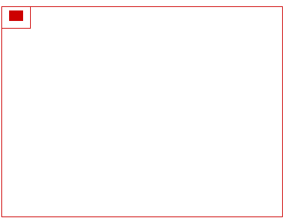
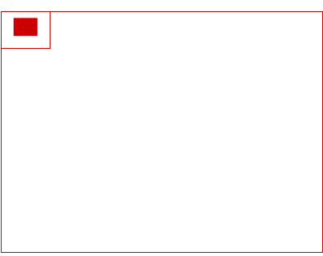
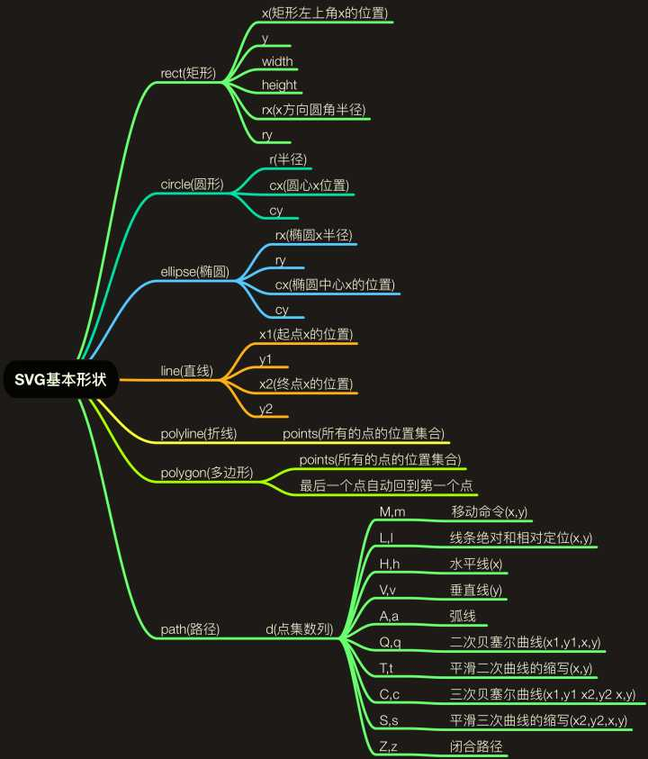
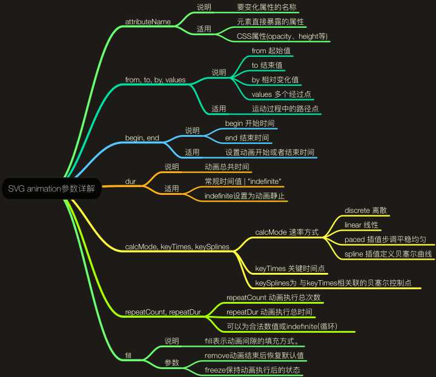

# SVG 扬帆起航

> 本文不能让你成为 SVG 大神，但是能让你知道、了解他「揭开神秘面纱」

## 基础认知

SVG「Scalable Vector Graphics」表示「可缩放矢量图形『放大不模糊』」面向未来「W3C 标准」。  
基本的 SVG 文档由 `<svg>` 根元素和 [基本形状元素](https://developer.mozilla.org/en-US/docs/Web/SVG/Element) 构成  
作为 XML 的一种方言，SVG 必须正确的绑定命名空间（在 xmlns 属性中绑定）。[命名空间速成](https://developer.mozilla.org/zh-CN/docs/Web/SVG/Namespaces_Crash_Course) 获取更多信息  
SVG 文件全局有效的规则是 「后来居上」，越后面的元素越可见。

### 能做什么

动画、图形、渐变、旋转、滤镜、JavaScript 接口、各种超酷的动画…

### 和 HTML 使用的几种方式

**``**  
不能使用JS来控制

**`.svg { background-image: url(xxx.svg);}`**  
最好不使用 base64 格式化 SVG「阻塞其它资源」、不能使用 JS 控制

**`<iframe src="xxx.svg">Not support iframe</iframe>`**

**`<embed type="image/svg+xml" src="xxx.svg" />`**

**`<object type="image/svg+xml" data="xxx.svg">Not support SVG</object>`**  
能使用JS来控制「推荐方式」

**`<svg xmlns="http://www.w3.org/2000/svg" viewBox="0 0 10 10">…</svg>`**  
节省 HTTP 请求，能使用 JS 控制，不能被浏览器缓存

### 坐标系统

看图说话「原点在左上角」：


### viewBox

```html
<svg width="400" height="300" viewBox="0,0,40,30" style="border:1px solid #cd0000;">
  <rect x="10" y="5" width="20" height="15" fill="#cd0000"/>
</svg>
```
[viewBox demo](https://jsfiddle.net/hangyangws/ectdkt4u/1/)

动画理解：  
  


[深度阅读 - viewBox](http://www.zhangxinxu.com/wordpress/2014/08/svg-viewport-viewbox-preserveaspectratio/)

## CSS、JS 与 SVG

### 内敛样式

```html
<svg xmlns="http://www.w3.org/2000/svg" viewBox="0 0 68 65">
  <style type="text/css">
    <![CDATA[
    .red { strock: #f00; }
    ]]>
  </style>
  <path class="red" d="M10 10v20" />
</svg>
```

### 外链样式

```html
<?xml-stylesheet type="text/css" href="xxx.css"?>
<svg xmlns="http://www.w3.org/2000/svg" viewBox="0 0 68 65">
  <path class="cls" d="M42 27v-20" />
</svg>
```

### JS 操作 SVG

如果 SVG 代码作为 DOM 在 HTML 内部，可以向平常一样操作 DOM 操作 SVG  
如果是使用 `<object>` 你可以使用 [contentDocument](https://developer.mozilla.org/zh-CN/docs/Web/API/HTMLIFrameElement/contentDocument) 来控制它 SVG

**注意**

1. ``、`background-image` 形式的 SVG 不支持「外链 CSS、JS」  
1. 内敛 CSS 和 JS 最好放在 `<![CDATA[` 与 `]]>` 之中

## SVG 基础元素

- `<svg>`：SVG 的根元素，可以相互嵌套
- `<g>`：将 SVG 中的元素进行分组操作，分组后可以看成一个单独的形状，统一转换
- `<defs>`：用于定义在 SVG 中可重用的元素，def 元素不会直接展示出来，可以通过 use 元素来引用
- `<use>`：通过它来复用 def 元素，也包括 `<g>、<symbol>` 元素，使用 `<use xlink:href="#id"/>` 调用
- `<text>`：文本节点，可以实现 word 中的那种「艺术字」
- `<image>`：在 SVG 中嵌套图片，可以对图片做对应的处理
- …

## SVG 形状元素

来张图压压惊：  


[点我查看 SVG 元素的基本 DEMO](https://jsfiddle.net/hangyangws/gc8m0nen/1/)

### `<path />`

别说话，先举个 🌰 ，一起感受一下 path：[点我](https://jsfiddle.net/hangyangws/ek7s4v1d/5/)

> 基于 path 的不同属性，可以画出各种各样的路径，所以 path 可算是 SVG 的「节点之王」  
除了 path 之外的节点都「比较普通」，可以看成是对 path 的封装，比如「Rect、Circle…」

**命令**  
命令都用一个关键字母来表示，命令 **都有两种** 表示方式

1. 大写字母，表示采用「绝对定位」
1. 小写字母，表示采用「相对定位『相对于上一个点』」

#### path 的命令列表

> `document.getElementById(‘path’).getTotalLength()` 得到路径长度

- M：moveto 移动到

- L：lineto 画线到；H：horizontal lineto 水平线到；V：vertical lineto 垂直线到

L 命令将会在当前位置和新位置之间画一条线段：L x y (or l dx dy)  
还有两个简写命令：H，绘制平行线。V，绘制垂直线。这两个命令都只带一个参数，标明在 x 或 y 轴移动到的位置：`H x (or h dx)` 、`V y (or v dy)`

- Z：closepath 关闭路径

Z 命令会从当前点画一条直线到路径的起点，所以它还是经常被放到路径的最后。另外，Z 命令不用区分大小写：Z (or z)

- C：curveto 三次贝塞尔曲线

`C x1 y1, x2 y2, x y` 或 `c dx1 dy1, dx2 dy2, dx dy`  
(x1, y1)、(x2, y2) 分别是起点、终点控制点。最后一个坐标 (x, y)，表示曲线的终点  
三次贝塞尔曲线 **表现形式** 是：曲线沿着 **起点开始** 到第一控制点的方向伸出，逐渐弯曲，然后沿着第二控制点到 **终点的方向结束**

- S：smooth curveto 光滑三次贝塞尔曲线

S 命令可以用来创建与之前那些曲线一样的贝塞尔曲线，通常和 C 命令一起使用  
如果 S 命令跟在一个 C 命令或者另一个 S 命令的后面，它的第一个控制点，就会被假设成前一个控制点的对称点，不应该写出来，所以 S 省略了一个对称点

- Q：quadratic Belzier curve 二次贝塞尔曲线

`Q x1 y1, x y` 或 `q dx1 dy1, dx dy`  

- T：smooth quadratic Belzier curveto 光滑二次贝塞尔曲线

`T x y` 或 `t dx dy`  
T 命令类似于 S 命令，用于二次贝塞尔曲线。T 命令前面最好是一个 Q 命令，或者是另一个 T 命令  
如果 T 单独使用，那么控制点就会被认为和终点是同一个点，所以画出来的将是一条直线

- A：elliptical Arc 椭圆弧

`A rx ry x-axis-rotation large-arc-flag sweep-flag x y` 或 `a rx ry x-axis-rotation large-arc-flag sweep-flag dx dy`

rx ry：「椭圆」的 x，y半径  
x-axis-rotation：X 轴旋转角度，顺时针为正数  
large-arc-flag：1 表示用大弧度，0 表示小弧度  
sweep-flag：弧度回话方向，1 顺时针，0 逆时针  
x y：弧度终点

## 元素与样式

- stroke
- fill
- transform
- linearGradient
- mask
- filter
- clipPath

一些 Demo：  
[svg 模糊 demo](https://jsfiddle.net/hangyangws/48uprrq5/)  
[symbol demo](https://jsfiddle.net/hangyangws/0odr1kky/)  
[symbol-use-demo](https://jsfiddle.net/hangyangws/6L15hotf/)  
[text mask demo](https://jsfiddle.net/hangyangws/1puLynrs/)  
[mask demo](https://jsfiddle.net/hangyangws/60q9srrd/)  
[clip demo](https://jsfiddle.net/hangyangws/Lh09hkpb/)  
[SVG 文字路径动画](https://jsfiddle.net/hangyangws/dwvgwnc2/)  
[linearGradient Demo](https://jsfiddle.net/hangyangws/yhxxdp6o/)

**使用 CSS 请注意**  
把 background-color、border 改成 fill 和 stroke  
上色和填充的部分一般是可以用 CSS 来设置的，比如 fill，stroke，stroke-dasharray，但不包括渐变和图案等。  
另外，width、height，以及路径的命令等等，都不能用 css 设置  
*不是所有的属性都能用 CSS 来设置*：[SVG 规范](https://www.w3.org/TR/SVG/propidx.html) 将属性区分成 properties 和 attributes，前者是可以用 CSS 设置的，后者不能

## SVG 动画

> [SVG 动画 集合](http://svgtrick.com/)  
SVG 的动画元素是和 SMIL [Synchronized Multimedia Integration Language](https://www.w3.org/TR/REC-smil/)开发组合作开发的。  
SMIL 开发组和 SVG 开发组合作开发了 SMIL 动画规范，在规范中制定了一个基本的 XML 动画特征集合。  
SVG 吸收了 SMIL 动画规范当中的动画优点，并提供了一些SVG继承实现。

大概三种实现方式：

- JS 动画「DOM 操作『忽视它』」
- CSS3 动画「animation、transition『不是 svg 的重点』」
- SVG 本身的动画「基于 SMIL」「主要借助 SVG `animate` 相关标签」



### set

set 表示此元素没有动画效果 😨😨😨。  
好吧：这样的，虽然 set 虽然不能触发连续的动画，但是，其还是可以实现基本的延迟功能。  
就是指：可以在特定时间之后修改某个属性值「也可以是 CSS 属性值」。

[一个 Demo](https://jsfiddle.net/hangyangws/d6m1oyng/1/)

### animate

SVG animation 最强大的地方在于：「只要在页面放几个 animate 元素，没有任何 CSS, 没有任何JS」


```xml
<animate
  id="id"
  begin="id.end + 1s"
  attributeName="r"
  attributeType="XML"
  from="50"
  to="80"
  by="30"
  values="50;80"
  begin="0s"
  dur=".5s"
  repeatCount="indefinite"
  fill="freeze">
</animate>
```

[一个 Demo](https://jsfiddle.net/hangyangws/vk3j2pk1/1/)

### animateColor

一看就知道是颜色动画。不过，animate 可以实现其功能与效果，因此，此属性已经被废弃。  
可谓因为兄弟相争而年少陨落的天王。逝者已矣，过去的就让它过去吧 ~~~

### animateTransform

```xml
<animateTransform
  attributeName="transform"
  attributeType="XML"
  type="rotate"
  from="0 125 135"
  to="360 125 135"
  begin="0s"
  dur="10s"
  repeatCount="indefinite">
</animateTransform>
```
[一个 Demo](https://jsfiddle.net/hangyangws/zqLorfo9/1/)

### animateMotion

animateMotion 元素可以让 SVG 各种图形沿着特定的 path 路径运动 ~~~

```xml
<animateMotion
  dur="6s"
  repeatCount="indefinite"
  path="M100 100, A120 120, -45 0 1, 300 300 A120 120, -45 0 1, 100 100">
</animateMotion>
```

[一个 Demo](https://jsfiddle.net/hangyangws/yxncvsph/1/)

### 例子分析

组合：  
[一个 Demo](https://jsfiddle.net/hangyangws/z0zLcm9c/1/)

end 事件：  
[一个 Demo](https://jsfiddle.net/hangyangws/xxm1wkx4/2/)

click 事件：  
[一个 Demo](https://jsfiddle.net/hangyangws/Lr8gs5gn/1/)

## 进阶阅读推荐

- [贝塞尔曲线原理「简单阐述」](http://www.cnblogs.com/hnfxs/p/3148483.html)

## 工具推荐

- svgo

项目地址：[点我查看](https://github.com/svg/svgo)  
比较厉害的压缩优化 SVG 的工具，可以将 SVG 中的无用信息删掉，同时支持代码进行压缩

- SVGOMG

展示地址：[SVGOMG - SVGO's Missing GUI](https://jakearchibald.github.io/svgomg/)  
SVGOMG 是 svgo 的可视化界面工具，操作起来很方便，还提供了一些其他有用的功能

- Snap.svg

项目地址：[Snap.svg - Home](http://snapsvg.io/)  
Snap.svg 是一个可以使你操纵 SVG 资源和 jQuery 操作 DOM 一样简单的类库，  
可以写出更加复杂的 SVG 效果，同时文档超级齐全，推荐给想深入了解的同学。
